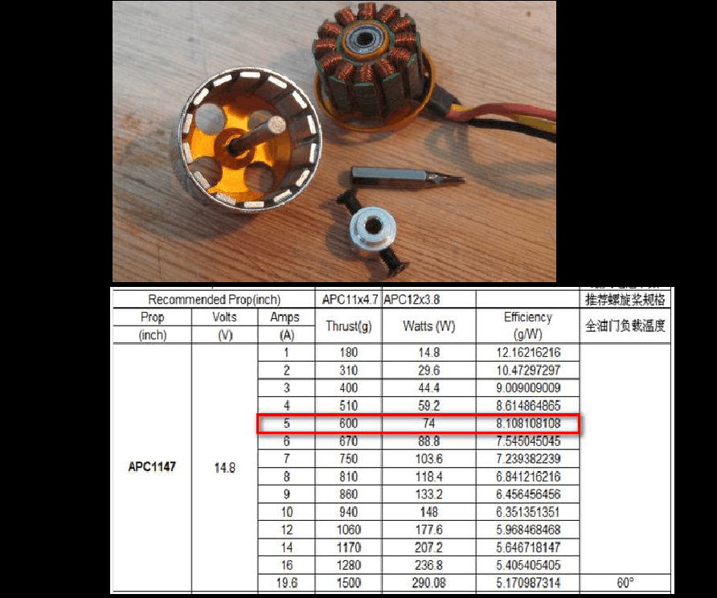

# 四轴组件简介
##  电机
### KV值 
大KV配小桨，小KV配大桨。 KV值是每1V的电压下电机每分钟空转的转速，例如KV800,在1V的电压下空转转速是800转每分钟。10V的电压下是8000转每分钟的空转转速。 绕线匝数多的，KV值低，最高输出电流小，但扭力大 绕线匝数少的，KV值高，最高输出电流大，但扭力小 
KV值越小，同等电压下转速越低，扭力越大，可带更大的桨。KV值越大，同等电压下转速越高，扭力越小，只能带小桨。相对的说KV值越小，效率就越高。航拍要选用低KV电机配大桨，转速低，效率高，同样低转速电机的震动也小。对航拍来说这些都是极为有利的

### 型号 
定子粗的，力气大。 
电机型号，如2212，3508，4010，这些数字表示电机定子的直径和高度（如下图）。前面两位是定子直径，后面两位是定子高度，单位是毫米。 
前两位越大，电机越肥，后两位越大，电机越高。又大又高的电机，力气大，效率高.

### 效率 
效率高 效率的标注方式是：g/W(克/每瓦）电机的功率和拉力并不是成正比的，也就是说50W的时候450g拉力，100W的时候就不是900g了，可能只有700g。具体效率要看电机的效率表。大多数的电机在3A~5A的电流下效率是最高的.
       一般正常飞行时，效率保持在合理的范围内，能够很好的保证续航能力。 以朗宇X3508S-700KV电机（下图）为例讲解，配APC1147桨，4S电池，5A电流时，效率8.1g/W，产生推力为600g，如果为4轴飞行器，共产生2.4公斤推力。对于4S 5000mAh电池，考虑各种影响因素，性能减半，续航时间也应该在30分钟以上吧。（没试过，理论推断！）

### 经验一
整机重量，应该小于电机最大动力的2/5。 很多入门玩航拍的都会选择2212电机，四轴超过1.5公斤的重量这电机就歇菜了。而大多入门航拍都是1.5~2KG的机子， 
四轴的升力除了把自身抬起来之外还要用一部分力来前进后退，左右横滚。最关键的还有抗风，我的建议就是保留五分之三的升力来做这些动作和抗风，而且电池电压降低后不至于升力不足而炸鸡。通俗的说就是2212电机四个最大拉力是3320克，整机重量不要超过最大拉力的五分之二，也就是1328克。如果超过这个界限，那么电机就是高负荷运行，后果就是效率变低，电机震动变大，（朗宇和XXD2212的动平衡很差，高速运行时整震动很大很大）影响飞控自稳，你会看到飞机起飞后不断颤抖。一遇到风就摇摇欲坠。我当初的第一台四轴也是2212电机带云台1800G左右，就是这种情况。经过我反复测试，起飞1400克以下就很稳，超过1500克就随时可能炸鸡

### 经验二
选电机一定要看参数表，如果没有参数表，请不要选择

Tiger-MOTO。做工优异，性能稳定，大多都出口国外。土豪们一般都用它。咱们穷屌就只能看着照片养养眼了。《JFRC飓风》这个品牌很多人都很陌生，因为它一直很低调。官方主页做的实在是烂。不过呢，据说飓风以前是给Tiger-MOTO做代工的。做工也是一流，效率质量都非常好。关键是性价比很高。我本人用的就是飓风的电机，真心不错。《朗宇》这个品牌相信大家都不陌生吧，旗下电机型号众多。以一流的做工，平民的价格成为了大众品牌。除了T.M跟飓风，就选它了。《银燕》《happy》《ho什么什么的》这几个品牌也还可以。做工还可以，价格也便宜。暂且归入二流品牌。剩下的好多都是三流品牌就不多说了

## 电调 
电调也就那么几个品牌可以选择。高富帅依旧是使用Tiger-MOTO的电调。咱也只能望图兴叹了。主流品牌好盈，蜘蛛，中特威。

## 螺旋浆
 螺旋桨规格，一般由4位数字表示，前两位数表示直径，后两位表示螺距。以1060浆为例，10表示桨的直径是10英寸，60表示浆角（螺距，6.0英寸，也就是152.4mm)
 桨算是四轴中很重要的一个配件，也是很容易损坏的一个配件。航拍需要的是稳定和效率，桨当然是选择APC和DJI
以Mavic Pro的折叠桨为例，桨上面标的数字和字母是8330F，首先看数字部分，可以分成83和30，这两个数字分别代表了桨展开之后的直径为8.3英寸以及桨的螺距（螺旋桨在一种不能流动的介质中旋转一圈之后桨平面前进的距离）为3.0英寸，F代表了可折叠的意思，即Folding。

## 四轴航拍电机桨搭配推荐：
3S电池1.8KG以下可用2216KV800电机搭配APC1147桨。  
3S电池2KG以下可用2810KV750电机搭配APC1238桨。  
3S电池2.5KG以下可用2814KV700电机搭配APC1340桨   
4S电池2.5KG以下可用2814KV600电机搭配APC1340桨   
3110KV650电机搭配APC1238桨  
3508KV580/KV700电机搭配DJI1555/APC1540桨。  
4108KV480/KV600电机搭配APC1447/APC1540桨   
6S电池，  
3KG以下可用3508KV380电机搭配DJI1555桨  
4108KV380电机搭配DJI1555桨   
4010KV320电机搭配DJI1555桨  
4008KV400电机搭配APC1447桨  

## 电池 
### 电池容量
5200mAh，意味着以5.2A电流放电，可以放1小时。当然，我们只是这么理解。实际放电时间，需要参考电池厂家提供的相关技术参数
### 放电能力
30C电池，指的是电池的放电能力。对于30C电池，最大持续放电电流为：电池容量X放电C。 例如:5200MA,30C电池，则最大的  $持续电流=5.2 \times 30=156A$ 。 如果该电池长时间超过156安或以上电流工作，那么电池的寿命会变短。 对于电池的单片电压，充满电时应为4.15-4.20较合适（3S电池对应12.6V），用后的最低电压为单片3.7以上（3S对应11.1V，切记不要过放），长期不用的保存电压最好为3.9（3S对应11.7V）
### 经验
飞机重量选择电池容量，太大的话飞行效率低，太小续航时间短，建议云台和图传单独使用一块3S电池供电，2200MAH15C足矣。记得不要买很便宜的电池

## 机架
### 机架的选择
   2kg以下的机子可以选玻纤机架；2kg以上的果断上3K碳纤维，当然价格也是不便宜；动手能力好的也可以自己制作机架。 
我应该用多大的机架呢？ 
    这个是有计算公式的，计算公式如下： 
    机架轴距 = $(桨的英寸\times 25.4\div 0.8\div \sqrt 2）\times 2$。 
    桨的尺寸（英寸） = $（机架轴距 \div 2）\times \sqrt 2 \times 0.8 \div 25.4$。

### 机架的平衡
如果不玩航拍，低脚架，可以不用管平衡，起飞后让飞控去调整平衡。就算你电池单边挂也不怕。 玩航拍大多都用高脚架。有必要做下平衡。 为什么？ 高脚架重心高，起飞和飞行中没问题，降落就没那么稳了，如果重心偏离很大的话落地时很容易翻机。所以重心偏离大的话就要调整了，主要调整电池安装位置就可以了。重心偏差一点没问题的，大致调下就可以了。